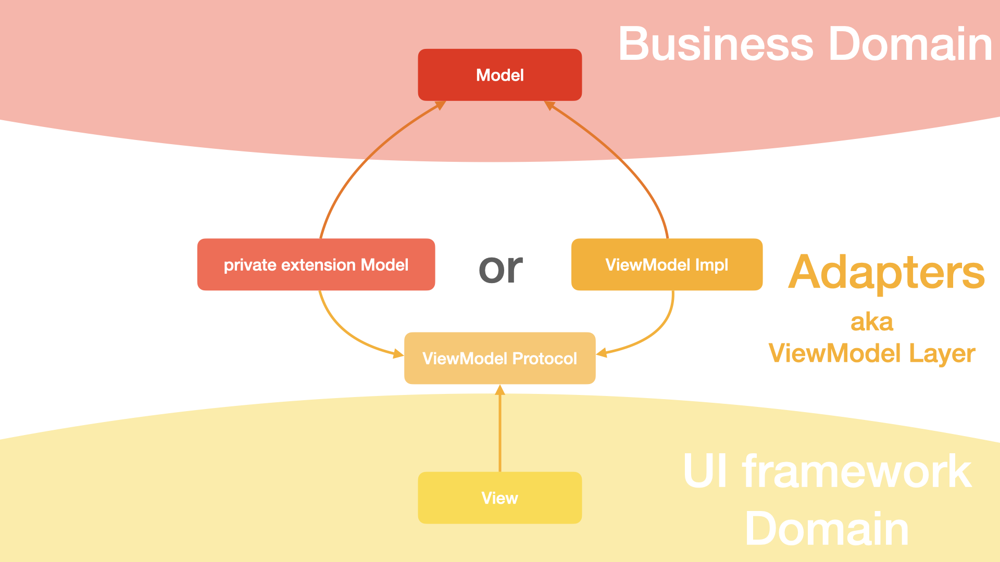
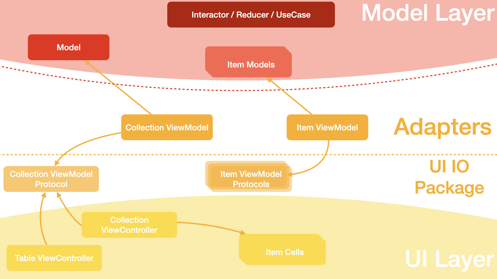

# UITableView collections with DIP. PoC

This is a PoC project demonstrating the implementation of the dependency inversion principle with reusable UITableViewCell's.

## Dependency inversion principle
* High-level modules should not import anything from low-level modules. Both should depend on abstractions (e.g., interfaces).
* Abstractions should not depend on details. Details (concrete implementations) should depend on abstractions.

## General concept
Роль ViewModel слоя (всё, что на белом фоне) заключается в согласовании Domain API c UI API.  
В этот слой входят: 
1. ViewModelProtocol'ы - контракты, которые реализует View слой. Это минимально необходимый интерфейс (отсылка к ISP)
2. Адаптеры, которые конвертируют Domain API в UI I/O Framework API и обратно

### TLDR;
> Слой нужен для реализации инкапсуляции на уровне слоя/модуля. 

Если возникает вопрос "зОчем?" стоит ответить себе на другой вопрос: "Для чего в OOП языки включены такие конструкции как
set/get, области видимости, private, internal, public? Что будет если всё сделать просто public?"

## Implementation for collections with reusable cells
То же самое, только для таблиц. Болше стрелок богу стрелок

